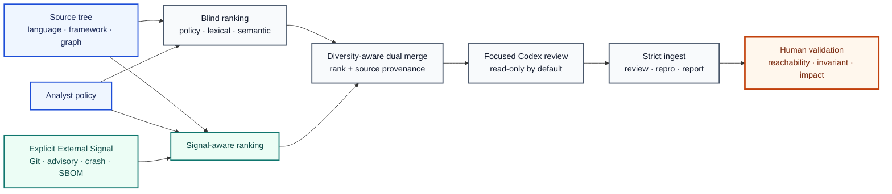

# Codex OSS Vulnerability Harness v2

[한국어](README.md) | [English](README.en.md)

[](https://github.com/foxirain/codex-oss-vuln-harness-v2/actions/workflows/ci.yml)

<p align="center"><strong>Research Tool · Standalone Import: 5 April 2026 · Documentation Revision: 25 July 2026</strong></p>

<p align="center"><strong>Core Philosophy — External Signal</strong><br>Use evidence outside model inference as a controlled search variable; let it allocate attention, never establish proof.</p>

> **Project status.** This repository preserves the early generalized lineage of an LLM-assisted research harness that was actually built and used for general OSS vulnerability research. This lineage was used in investigations that led to three disclosed CVEs and three assigned CVEs awaiting upstream publication. The harness does not confirm vulnerabilities automatically. Humans performed reachability analysis, reproduction, impact validation, and disclosure after candidate prioritization.
>
> The public Git history begins with the standalone import on 2026-4-5 and must not be interpreted as the workflow's original creation date. Per-finding session logs from the iterations at that time were also not preserved consistently, so this document does not retrospectively attribute each CVE to a specific `blind`, `signal`, or `dual` execution mode.

## Abstract

**Abstract—** General OSS security review is difficult to constrain reliably with the same static rules or a single LLM prompt because languages, frameworks, entrypoints, and trust boundaries differ across repositories. `Codex OSS Vulnerability Harness v2` defines this as a problem of **attention allocation and reproducible investigation orchestration**, not automatic vulnerability determination. The project calls policy, source structure, import graphs, Git history, advisory hints, crash evidence, and SBOM context obtained outside model inference **External Signal**, and separates the effect of that signal on candidate ranking into `blind`, `signal-aware`, and `dual` searches. The blind arm provides a baseline without external signal or Git history; the signal arm adds explicit evidence to the same source analysis; and the dual arm deduplicates both rankings and applies path diversity to combine their investigation budgets. Each candidate becomes a narrow prompt bundle, and only results satisfying a strict verdict and structured proof fields are eligible for promotion. The early lineage of this workflow was used in real OSS investigations involving SSRF destination validation, cross-interface authorization consistency, and OAuth request-response binding, resulting in three disclosed CVEs. This implementation is neither a sound static analyzer nor an autonomous vulnerability detector. A human must revalidate every finding's entrypoint, attacker control, sink or invariant break, concrete impact, and absence of an effective existing check.

**Index Terms—** vulnerability research, open-source software, external signal, LLM orchestration, differential search, authorization analysis, attack-surface prioritization, Codex.

## I. Introduction

Vulnerability research across general OSS repositories presents a different kind of diversity from kernel research. The same attack surface can appear in entirely different forms, such as a Python route, PHP controller, Go handler, C parser, or GitHub Actions workflow. Conversely, risk signals such as `eval`, outbound requests, file access, and authorization checks are common, but their presence alone does not constitute a vulnerability.

The first questions to answer are therefore not “which bug class exists?” but the following:

1. Which code actually receives external input?
2. Which trust boundary does that input cross?
3. Which sink or security invariant does it encounter?
4. Does the current validation logic block a real attack?
5. How do the search results differ with and without external evidence?

The core philosophy of this project is **External Signal**.

> Do not ask the model to search an entire repository without direction. Allocate attention with reproducible evidence from outside the model, but never promote the existence of that evidence into vulnerability proof.

In v2, External Signal is treated as a **controllable search variable**, not merely an additive scoring factor. The system separately generates a baseline without external evidence and a ranking with that evidence so their overlap and novelty can be observed.

## II. External Signal and Design Principles

### A. External Signal as an Experimental Variable

In this document, External Signal means observations collected before model execution or independently of the model.

- analyst-authored scope and hot paths
- language and framework markers
- source-level entrypoint and sink patterns
- lightweight semantic symbol information
- internal import-graph fan-in and fan-out
- recent Git churn and security-like commit history
- file hints derived from advisories, CVEs, issues, and PRs
- source locations from sanitizer, panic, and crash logs
- explicitly provided SBOM components and vulnerability context

These signals change candidate ranking and prompt context. Their source or weight, however, is not a probability of vulnerability validity or exploitability.

### B. Prioritization Is Not Proof

A high score means there is a reason to investigate that file earlier. Concluding that it contains a vulnerability requires the following separate proof chain.

```text
attacker-reachable entrypoint
        → attacker-controlled value or state
        → sensitive sink or invariant break
        → existing check does not block the path
        → concrete security impact
```

Advisory adjacency, crash traces, and high graph centrality cannot replace this chain.

### C. Blind, Signal-Aware, and Dual Search

v2 provides three search perspectives to isolate the effect of External Signal.

**TABLE I — SEARCH MODE SEMANTICS**

| Mode | Included evidence | Intended role |
| --- | --- | --- |
| `blind` | Policy, language rules, lexical signals, semantic hints, import graph | Source-driven baseline with external evidence and Git history removed |
| `signal` | Blind-side analysis + Git history + explicit signals + crash logs + SBOM | Observe how known evidence moves the ranking |
| `dual` | Deduplicated candidates drawn from both arms | Combine baseline coverage and signal-guided focus within one review budget |

`blind` does not mean analysis with no information. It retains the same policy and source structure. What it removes is Git history and explicit external, crash, and SBOM enrichment.

### D. Evidence Before Confidence

For a strong verdict to be promoted to a finding, all five of the following fields must contain meaningful values.

- `entrypoint`
- `attacker_control`
- `sink`
- `impact`
- `not_blocked_by`

Placeholders such as `unknown`, `none`, `TBD`, and `insufficient evidence` are not accepted as proof. Concrete boundaries and failed checks take precedence over expressions of confidence.

### E. Bounded Exploration

Each review handles one target and one best next target. Manual follow-up is limited to two levels. Branches that repeat the same target or a low-yield subsystem are cooled so the entire budget is not exhausted on one path.

### F. Human Closure

The LLM assists with candidate ranking, source navigation, and generation of falsification hypotheses. A human closes the final finding through the following process.

1. Confirm the actual execution path.
2. Confirm attacker privileges and prerequisites.
3. Reproduce the issue with negative controls.
4. Validate impact scope and affected versions.
5. Coordinate disclosure with the maintainer.

## III. System Architecture



<p align="center"><strong>Fig. 1.</strong> External Signal is switched on and off as a controlled ranking variable. Blind and signal-aware candidate sets are merged into a provenance-preserving review session; vulnerability proof remains outside automated ranking.</p>

**TABLE II — MAJOR MODULE RESPONSIBILITIES**

| Module | Responsibility |
| --- | --- |
| `targeting.py` | Multi-language file discovery, scoring, generated-artifact suppression, and exposure classification |
| `semantic.py`, `graph.py` | Symbol, entrypoint, and sink hints plus internal import/reference graph computation |
| `history.py`, `external.py`, `sbom.py` | Collection of Git, advisory, crash/sanitizer, and SBOM signals |
| `dual.py`, `bundle.py` | Blind/signal deduplication, diversity-aware merge, and session and prompt-bundle generation |
| `session.py`, `ingest.py`, `autopilot.py` | Review state, strict verdict parsing, time-budgeted execution, and branch cooling |
| `review_schema.py`, `reviewing.py` | Structured evidence validation and S–D tier reassessment |
| `repro.py`, `reporting.py` | Validation of the Codex response execution/output envelope before recording reproduction and report artifacts |
| `paths.py`, `provenance.py` | Repository containment and source/input provenance recording |

## IV. Methodology

### A. Policy-Driven Scope

Each target repository can define its investigation scope with a Markdown policy.

```bash
oss-harness init-policy /path/to/target/.codex-harness.md
```

The policy separates in-scope and out-of-scope surfaces, entrypoints, hot paths, preferred sinks and bug classes, include and exclude paths, and language and framework hints. When a policy is auto-discovered inside the target repository, its provenance is recorded as `repository-provided-untrusted`. A source-controlled policy must be treated as model input, not as trusted instructions.

### B. Candidate Scoring

The score for file `f` can be expressed conceptually as follows.

```text
Score(f) =
    S_path(f)
  + S_policy(f)
  + S_lexical(f)
  + S_semantic(f)
  + S_graph(f)
  + I_signal · [S_git(f) + S_external(f) + S_crash(f) + S_sbom(f)]
  - P_generated(f)
```

`I_signal` is a search variable set to `0` in the blind arm and `1` in the signal-aware arm. The implementation also includes language-specific rules, entrypoint–sink proximity, trust-boundary alignment, and retention exceptions. This score is not a probability or CVSS value; it is the candidate's relative review order.

### C. Multi-Language Targeting

The primary language families are Python, JavaScript/TypeScript, Go, Rust, C/C++, Java/Kotlin, PHP, and Ruby. Language rules detect different representations of entrypoints and sinks, including routes, request access, authentication boundaries, unsafe deserialization, command execution, filesystem access, outbound requests, and native memory operations.

Python uses AST-based symbol indexing. Other languages use lightweight function and handler extraction, which is not equivalent to compiler-grade semantic analysis.

### D. Dual Merge

`scan-dual` runs blind and signal-aware scans independently. The merge stage alternates between the two arms and deduplicates identical paths. It first applies diversity limits to prevent excessive concentration in header-only files, subsystems, or exposure classes, then fills the remaining budget with a relaxed pass.

Merged candidates retain their blind rank, signal rank, source arm, and final merged rank. Dual novelty means candidate differences between the two rankings, not a count of new vulnerabilities.

### E. Focused Prompt Profiles

The harness selects a `lean`, `balanced`, or `deep` profile according to the candidate's score, language, exposure, sink, and external evidence. Each prompt first requires an attempt to falsify the finding. If the path is not a real entrypoint or an existing verifier blocks it, the response must return a strict negative verdict.

### F. Verdict and Promotion Contract

A candidate audit response must contain exactly one of the following verdicts.

- `cve_candidate`
- `plausible_security_bug`
- `latent_bug`
- `not_cve_candidate`
- `needs_more_context`

Even a strong verdict is not promoted to a finding if structured proof fields are missing. Timeouts, nonzero process exits, missing responses, and schema errors are recorded as operational failures rather than audit verdicts and are retried.

### G. Review, Reproduction, and Reporting

Promoted findings can be reassessed as `S`, `A`, `B`, `C`, or `D` tier in a separate review stage. The reproduction and report stages do not allow the model to write arbitrarily to the artifact directory. The harness validates final output received through `codex exec -o` before recording structured artifacts. These stages assist report preparation but do not guarantee that a generated reproduction is safe.

## V. Implementation and Usage

### A. Requirements

- Python 3.11 or later
- Codex CLI and authentication when using automated review
- project-specific dependencies needed to build or reproduce the actual target
- a separate virtual environment when used alongside v3

### B. Installation

```bash
git clone https://github.com/foxirain/codex-oss-vuln-harness-v2.git
cd codex-oss-vuln-harness-v2

python3 -m venv .venv
source .venv/bin/activate
python -m pip install .
```

### C. Minimal Workflow

```bash
# 1. Create a target-specific policy.
oss-harness init-policy /path/to/target/.codex-harness.md

# 2. Build and inspect a ranked session.
oss-harness scan /path/to/target \
  --policy /path/to/target/.codex-harness.md \
  --out /tmp/oss-artifacts \
  --limit 120 \
  --top 30

oss-harness inspect /tmp/oss-artifacts/session-<UTC-timestamp> --top 10
```

A normal `scan` uses Git-history enrichment even without an explicit signal file. The baseline with external evidence removed is available in the `blind/` session generated by `scan-dual`.

### D. Explicit External Inputs

```bash
oss-harness scan /path/to/target \
  --policy /path/to/target/.codex-harness.md \
  --signals-json /path/to/signals.json \
  --crash-dir /path/to/crash-logs \
  --sbom /path/to/sbom.json \
  --out /tmp/oss-artifacts
```

External signals, crash directories, and SBOMs are not selected automatically. Supplied paths and hashes are recorded in session provenance.

- [`configs/oss/generic-policy-template.md`](configs/oss/generic-policy-template.md)
- [`configs/oss/signals-template.json`](configs/oss/signals-template.json)

### E. Blind/Signal Dual Workflow

```bash
oss-harness scan-dual /path/to/target \
  --policy /path/to/target/.codex-harness.md \
  --signals-json /path/to/signals.json \
  --crash-dir /path/to/crash-logs \
  --sbom /path/to/sbom.json \
  --out /tmp/oss-artifacts \
  --limit 120 \
  --top 10
```

The output contains separate `blind`, `signal`, and `merged` sessions. For combined review, use the `merged_session` path printed by the command.

### F. Time-Budgeted Autopilot

```bash
oss-harness autopilot /tmp/oss-artifacts/session-<UTC-timestamp> \
  --duration 2h \
  --per-run-timeout 20m \
  --include-snippet
```

The Codex sandbox defaults to `read-only`. `--full-auto` is permitted only when a writable sandbox is explicitly selected.

### G. Review-to-Report Workflow

```bash
oss-harness review /tmp/oss-artifacts/session-<UTC-timestamp>

oss-harness repro /tmp/oss-artifacts/session-<UTC-timestamp> \
  --tier-min B

oss-harness report /tmp/oss-artifacts/session-<UTC-timestamp> \
  --tier-min B \
  --template /path/to/report-template.md
```

### H. Benchmarking Search Modes

```bash
oss-harness benchmark-modes configs/benchmark/ot0-diverse-template.json
```

The benchmark's `labeled_hotspot_precision` and `labeled_hotspot_recall` are ranking metrics against analyst-supplied path labels. They are not vulnerability-detection precision or recall. `review_confirmation_rate` is the proportion receiving tier B or higher in the review stage, not human ground-truth precision.

### I. Session Artifacts

```text
artifacts/session-<timestamp>/
├── SESSION.md
├── targets.json
├── finding_template.json
├── review_state.json
├── codex_response.txt
├── bundles/
├── responses/
├── autopilot/
│   ├── AUTOPILOT_STATUS.txt
│   ├── AUTOPILOT_PROGRESS.txt
│   ├── prompts/
│   ├── exec/
│   └── findings/
├── review/
├── repro/
└── reports/
```

Dual scans use the `artifacts/dual-session-<timestamp>/{blind,signal,merged}/` layout.

## VI. Operational Outcomes

This repository preserves the early lineage of a real OSS security-research workflow; it is not an artifact produced retrospectively for a CVE benchmark.

**TABLE III — PUBLICLY DISCLOSED SECURITY OUTCOMES**

| Public outcome | Project | Severity / CVSS | Publicly documented security boundary | Validation pattern |
| --- | --- | --- | --- | --- |
| [CVE-2026-33953](https://github.com/Kovah/LinkAce/security/advisories/GHSA-wp4g-qw9j-wfjg) | LinkAce |  **8.5 · CVSS 3.1** (GHSA) | SSRF destination mismatch between private-IP literal filtering and internal-hostname resolution | Differential validation of a direct private IP and a hostname resolving to the same internal destination |
| [CVE-2026-33954](https://github.com/Kovah/LinkAce/security/advisories/GHSA-88h3-cq25-vw8q) | LinkAce |  **6.5 · CVSS 3.1** (GHSA) | Private-note authorization inconsistency between the API and web detail view | Visibility-matrix validation using two users and two interfaces |
| [CVE-2026-34460](https://github.com/NamelessMC/Nameless/security/advisories/GHSA-pmpw-2xvh-5xj6) | NamelessMC |  **5.4 · CVSS 3.1** (GHSA) | Missing server-side `state` binding between OAuth authorization request and callback | Callback replay and session-swapping validation using two browser sessions |

<details>
<summary><strong>CVSS provenance (checked 2026-08-09)</strong></summary>

- `CVE-2026-33953`: linked GitHub Security Advisory · 8.5 High · `CVSS:3.1/AV:N/AC:L/PR:L/UI:N/S:C/C:H/I:L/A:N`
- `CVE-2026-33954`: linked GitHub Security Advisory · 6.5 Moderate · `CVSS:3.1/AV:N/AC:L/PR:L/UI:N/S:U/C:H/I:N/A:N`
- `CVE-2026-34460`: linked GitHub Security Advisory · 5.4 Moderate · `CVSS:3.1/AV:N/AC:L/PR:N/UI:R/S:U/C:L/I:L/A:N`
- The officially published scores and vectors are reproduced without independent rescoring.

</details>

All three official advisories list the researcher's reporting account, [`@Amemoyoi`](https://github.com/Amemoyoi), as the reporter.

The `Validation pattern` entries above summarize reproduction methods documented in the public advisories. Because not all session artifacts from that period were preserved, this document does not claim that a specific CVE came directly from `blind`, `signal`, or `dual` mode, a specific prompt profile, or a specific automation command.

The harness lineage was used to narrow investigation candidates and iterate on source-level hypotheses. For each final claim, a human configured the environment, compared positive and negative cases, and reported the result to the maintainer.

### A. Assigned CVEs Pending Upstream Publication

Three additional issues found through the same early research workflow have assigned CVE identifiers that may be disclosed. Because the upstream advisories are not yet public, the targets are identified only by general product category; technical details such as bug class, impact, reproduction, and patch will be added after official publication.

**TABLE IV — ASSIGNED IDENTIFIERS PENDING UPSTREAM PUBLICATION**

| Assigned identifier | Target description | Severity / CVSS | Publication state | Detail boundary |
| --- | --- | --- | --- | --- |
| CVE-2026-33546 | Streaming software |  | Upstream publication pending | Technical details intentionally omitted |
| CVE-2026-33547 | Streaming software |  | Upstream publication pending | Technical details intentionally omitted |
| CVE-2026-41210 | Streaming software |  | Upstream publication pending | Technical details intentionally omitted |

<details>
<summary><strong>CVSS provenance (checked 2026-08-09)</strong></summary>

- None of the three identifiers has a public CNA/CVE record or upstream advisory with a published severity, score, or vector.
- No independent scores were assigned; these entries can be updated after official publication.

</details>

These three are recorded as assigned CVEs from the research, but they are excluded from the public-outcome table and disclosed-CVE subtotal above until the upstream advisories are published.

## VII. Engineering Verification

The current regression suite verifies harness state integrity, safety boundaries, and distributability rather than vulnerability-detection performance.

**TABLE IV — VERIFICATION SCOPE**

| Verification item | Expected property |
| --- | --- |
| Path containment | Block absolute paths, traversal, Windows drives, UNC paths, and symlink escapes |
| Safe repository scan | Do not use symlinked files or directories as candidates or snippets |
| Verdict contract | Permit exactly one strict verdict |
| Promotion contract | Do not promote a strong verdict lacking the five proof fields to a finding |
| Failure propagation | Do not record nonzero exits, timeouts, missing output, or parse errors as semantic verdicts |
| Retry state | Separate operational retries from completed-review history |
| Dual merge | Preserve blind/signal provenance, deduplication, and deterministic diversity behavior |
| Safe default | Codex sandbox defaults to `read-only` |
| Installed artifact | Smoke-test imports and the CLI outside the checkout after wheel installation |
| CI matrix | Run the regression suite on Python 3.11 and 3.12 |

```bash
python -m unittest discover -s tests -v
bash -n scripts/*.sh
```

The current suite contains 56 regression tests. GitHub Actions runs unit regressions, shell-syntax checks, wheel builds, and installed-CLI smoke tests. The disclosed CVE cases are real operational outcomes, but they are not a benchmark of precision, recall, or discovery rate measured on a representative corpus.

## VIII. Safety Considerations

1. Retain the default `read-only` sandbox for Codex execution.
2. Do not use `--dangerously-bypass-approvals-and-sandbox` outside an isolated disposable environment.
3. Read-only prevents target mutation but does not guarantee the confidentiality of host-readable secrets.
4. Analyze untrusted repositories in a container or VM without credentials or tokens.
5. Source comments, identifiers, and auto-detected policies inside a repository can also be prompt-injection inputs.
6. An external signal file is an analyst-provided targeting hint, not vulnerability proof.
7. Do not execute model-generated reproduction scripts without review.
8. Follow the affected project's disclosure policy and embargo before publishing a finding.

## IX. Limitations and Threats to Validity

1. **Heuristic analysis.** The harness does not construct compiler-grade interprocedural data flow, a full call graph, or formal reachability.
2. **Language asymmetry.** Python uses AST-based symbol analysis, while other languages depend on lightweight extraction.
3. **Score bias.** Large files, repeated sink tokens, and framework markers can distort ranking.
4. **History bias.** Git security history can overconcentrate the search on already known hotspots.
5. **Blind baseline scope.** Blind mode still uses policy, lexical rules, semantics, and graphs, so it is not a complete no-prior baseline.
6. **External evidence quality.** Inaccurate advisory hints, crash logs, or SBOM mappings can promote irrelevant paths.
7. **Dual heuristic.** Diversity quotas and deduplication assist search-space coverage but do not guarantee optimality.
8. **Model dependence.** Results depend on the model used, prompt interpretation, repository size, and available context.
9. **Historical attribution.** Immutable session logs were not preserved for each early investigation, so historical CVEs cannot be linked to a specific mode or public commit.
10. **Evaluation scope.** Software regressions and path-ranking benchmarks do not establish vulnerability-detection accuracy.

## X. Design Evolution and Retrospective

**TABLE V — RECORDED EVOLUTION**

| Date | Recorded direction |
| --- | --- |
| 5 Apr. 2026 | Standalone generalized OSS harness, policy, multi-language targeting, and autopilot import |
| 5 Apr. 2026 | Added bootstrap, secondary review, reproduction, and report workflows |
| 8 Apr. 2026 | Native exposure, retention logic, SBOM enrichment, and generated-artifact suppression |
| 9 Apr. 2026 | Prompt/context optimization and targeting fixes |
| 10 Apr. 2026 | Blind/signal dual search and cross-repository benchmark workflow |
| 11 Jul. 2026 | Path containment, read-only execution, strict schema, failure propagation, and CI hardening |

The most important change in v2 was not “adding more External Signal,” but **separating and comparing results with and without the signal**. The blind arm preserves a source-driven baseline, the signal arm shows where evidence moves attention, and the dual arm treats neither ranking as ground truth.

The later [Adaptive Codex OSS Vulnerability Harness](https://github.com/foxirain/codex-adaptive-oss-vuln-harness) extends this architecture with a fixed high-priority prefix, adaptive tail exploration, and multi-session merge. The two distributions share the Python import package name `oss_harness` and therefore must be installed in separate virtual environments.

If designing v2 again today, the priorities would be:

1. a common tree-sitter-based multi-language AST and call graph
2. immutable experiment manifests and per-finding provenance
3. a versioned search protocol that fixes blind/signal assignment
4. score normalization accounting for source size and repeated tokens
5. machine-verifiable oracles for reproduction results
6. a human-labeled benchmark corpus and confidence intervals
7. stronger process/container isolation for untrusted source

The central principle to preserve remains **External Signal**.

> External evidence should change where the investigation looks, not what the investigation is allowed to conclude.

## XI. Conclusion

`Codex OSS Vulnerability Harness v2` is not an autonomous scanner that replaces general OSS vulnerability analysis. It reduces attack surfaces across diverse languages and frameworks into explainable candidate rankings, isolates External Signal as a control variable, and places LLM review inside a strict evidence contract and bounded state machine.

The early lineage of this workflow led to three disclosed CVEs and three assigned CVEs awaiting upstream publication through real OSS investigations. The project's central result is not only the CVE count. It applied a research method that **prioritizes external evidence, differential validation, falsification, and human proof over model confidence** to a real disclosure workflow.

## Appendix A. Repository Layout

```text
.
├── .github/workflows/ci.yml
├── configs/
│   ├── benchmark/
│   └── oss/
├── docs/
│   ├── BENCHMARKING.md
│   └── OSS_HARNESS.md
├── oss_harness/
│   ├── autopilot.py
│   ├── bundle.py
│   ├── cli.py
│   ├── dual.py
│   ├── external.py
│   ├── ingest.py
│   ├── paths.py
│   ├── provenance.py
│   ├── repro.py
│   ├── reporting.py
│   ├── reviewing.py
│   ├── session.py
│   └── targeting.py
├── scripts/
├── tests/
├── README.md
└── pyproject.toml
```

For detailed commands and policy format, see [`docs/OSS_HARNESS.md`](docs/OSS_HARNESS.md); for benchmark interpretation, see [`docs/BENCHMARKING.md`](docs/BENCHMARKING.md).

## References

[1] OpenAI, “Codex CLI.” <https://developers.openai.com/codex/cli/>

[2] Kovah, “SSRF protection can be bypassed via internal hostname resolution in LinkAce,” GitHub Security Advisory GHSA-wp4g-qw9j-wfjg, 2026. <https://github.com/Kovah/LinkAce/security/advisories/GHSA-wp4g-qw9j-wfjg>

[3] Kovah, “Private notes are disclosed to unauthorized authenticated users via the web link detail page in LinkAce,” GitHub Security Advisory GHSA-88h3-cq25-vw8q, 2026. <https://github.com/Kovah/LinkAce/security/advisories/GHSA-88h3-cq25-vw8q>

[4] NamelessMC, “OAuth callback state is not validated, allowing login CSRF / session swapping,” GitHub Security Advisory GHSA-pmpw-2xvh-5xj6, 2026. <https://github.com/NamelessMC/Nameless/security/advisories/GHSA-pmpw-2xvh-5xj6>

[5] foxirain, “Adaptive Codex OSS Vulnerability Harness,” GitHub repository. <https://github.com/foxirain/codex-adaptive-oss-vuln-harness>

## License

Licensed under the [Apache License 2.0](LICENSE).
