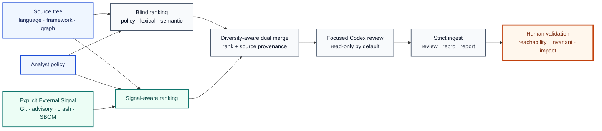

# Codex OSS Vulnerability Harness v2

[](https://github.com/foxirain/codex-oss-vuln-harness-v2/actions/workflows/ci.yml)

<p align="center"><strong>Research Tool · Standalone Import: 5 April 2026 · Documentation Revision: 25 July 2026</strong></p>

<p align="center"><strong>Core Philosophy — External Signal</strong><br>Use evidence outside model inference as a controlled search variable; let it allocate attention, never establish proof.</p>

> **Project status.** 이 저장소는 일반 OSS 취약점 조사를 위해 실제로 구축하고 사용한 LLM-assisted research harness의 초기 generalized lineage를 보존한다. 이 lineage는 공개된 세 건의 CVE 조사와 upstream publication을 기다리는 식별자 부여 CVE 세 건의 조사에 사용됐다. 하네스는 취약점을 자동으로 확정하지 않는다. 후보 우선순위화 이후의 reachability 분석, 재현, 영향 검증과 disclosure는 사람이 수행했다.
>
> 공개 Git 이력은 2026년 4월 5일의 standalone import부터 시작하므로 이를 workflow의 최초 생성일로 해석해서는 안 된다. 또한 당시 iteration 과정의 per-finding session log가 일관되게 보존되지 않아, 이 문서는 각 CVE를 사후적으로 `blind`, `signal`, `dual` 중 특정 실행 모드에 귀속하지 않는다.

## Abstract

**Abstract—** 일반 OSS 보안 검토는 언어, framework, entrypoint와 trust boundary가 저장소마다 달라 동일한 정적 규칙이나 하나의 LLM prompt만으로 탐색 범위를 안정적으로 통제하기 어렵다. `Codex OSS Vulnerability Harness v2`는 이 문제를 취약점 자동 판정이 아닌 **attention allocation과 reproducible investigation orchestration**의 문제로 정의한다. 이 프로젝트는 모델 추론 밖에서 얻은 policy, source structure, import graph, Git history, advisory hint, crash evidence와 SBOM context를 **External Signal**이라 부르고, 이 신호가 후보 순위를 바꾸는 효과를 `blind`, `signal-aware`, `dual` search로 분리한다. Blind arm은 외부 신호와 Git history를 제거한 baseline을 제공하고, signal arm은 동일한 source analysis에 명시적 evidence를 추가하며, dual arm은 두 ranking의 중복을 제거하고 path diversity를 적용해 탐색 예산을 결합한다. 각 후보는 좁은 prompt bundle로 변환되고, strict verdict와 structured proof fields를 만족한 결과만 promotion 대상이 된다. 이 workflow의 초기 lineage는 SSRF destination validation, cross-interface authorization consistency, OAuth request-response binding을 포함한 실제 OSS 조사에 사용됐고 세 건의 CVE로 공개됐다. 본 구현은 sound static analyzer나 autonomous vulnerability detector가 아니며, 모든 finding은 사람이 entrypoint, attacker control, sink 또는 invariant break, concrete impact와 existing check의 부재를 다시 검증해야 한다.

**Index Terms—** vulnerability research, open-source software, external signal, LLM orchestration, differential search, authorization analysis, attack-surface prioritization, Codex.

## I. Introduction

일반 OSS 저장소를 대상으로 하는 취약점 탐색에는 커널과 다른 종류의 다양성이 존재한다. 동일한 공격면도 Python route, PHP controller, Go handler, C parser 또는 GitHub Actions workflow처럼 전혀 다른 형태로 나타난다. 반대로 `eval`, outbound request, file access, authorization check와 같은 위험 신호는 흔하지만 그 존재만으로 취약점이 되지는 않는다.

따라서 먼저 답해야 하는 질문은 “어떤 bug class가 있는가”가 아니라 다음과 같다.

1. 어떤 코드가 외부 입력을 실제로 받는가?
2. 그 입력이 어떤 trust boundary를 통과하는가?
3. 어떤 sink 또는 security invariant와 만나는가?
4. 현재 검증 로직이 실제 공격을 차단하는가?
5. 외부 evidence를 제공했을 때와 제공하지 않았을 때 탐색 결과가 어떻게 달라지는가?

이 프로젝트의 핵심 철학은 **External Signal**이다.

> 모델에게 저장소 전체를 막연하게 탐색시키지 않는다. 모델 바깥의 재현 가능한 evidence로 attention을 배분하되, 그 evidence의 존재를 취약점 proof로 승격하지 않는다.

v2에서 External Signal은 단순한 점수 가산 요소를 넘어 **통제 가능한 탐색 변수**로 다뤄진다. 외부 evidence를 제거한 baseline과 evidence를 포함한 ranking을 따로 생성하고, 두 결과의 overlap과 novelty를 관찰할 수 있도록 설계했다.

## II. External Signal and Design Principles

### A. External Signal as an Experimental Variable

이 문서에서 External Signal은 모델 실행 전 또는 모델과 독립적으로 수집된 관찰값을 뜻한다.

- analyst-authored scope와 hot path
- language 및 framework marker
- source-level entrypoint와 sink pattern
- lightweight semantic symbol 정보
- internal import graph fan-in과 fan-out
- recent Git churn과 security-like commit history
- advisory·CVE·issue·PR 기반 file hint
- sanitizer·panic·crash log의 source location
- 명시적으로 제공된 SBOM component와 vulnerability context

이 신호는 후보 ranking과 prompt context를 변경한다. 그러나 신호의 source나 weight는 vulnerability validity 또는 exploitability 확률이 아니다.

### B. Prioritization Is Not Proof

높은 score는 해당 파일을 먼저 조사할 이유가 있다는 의미다. 취약점이라고 결론 내리려면 별도로 다음 proof chain이 필요하다.

```text
attacker-reachable entrypoint
        → attacker-controlled value or state
        → sensitive sink or invariant break
        → existing check does not block the path
        → concrete security impact
```

Advisory adjacency, crash trace, high graph centrality도 이 chain을 대신하지 못한다.

### C. Blind, Signal-Aware, and Dual Search

v2는 External Signal의 효과를 분리하기 위해 세 가지 탐색 관점을 제공한다.

**TABLE I — SEARCH MODE SEMANTICS**

| Mode | Included evidence | Intended role |
| --- | --- | --- |
| `blind` | Policy, language rules, lexical signals, semantic hints, import graph | External evidence와 Git history를 제거한 source-driven baseline |
| `signal` | Blind-side analysis + Git history + explicit signals + crash logs + SBOM | Known evidence가 ranking을 어떻게 이동시키는지 관찰 |
| `dual` | Deduplicated candidates drawn from both arms | Baseline coverage와 signal-guided focus를 하나의 review budget에서 결합 |

`blind`는 정보가 전혀 없는 분석을 뜻하지 않는다. 동일한 policy와 source structure는 유지된다. 제거되는 것은 Git history와 명시적 external/crash/SBOM enrichment다.

### D. Evidence Before Confidence

강한 verdict가 finding으로 promotion되려면 다음 다섯 필드가 모두 의미 있는 값을 가져야 한다.

- `entrypoint`
- `attacker_control`
- `sink`
- `impact`
- `not_blocked_by`

`unknown`, `none`, `TBD`, `insufficient evidence` 같은 placeholder는 proof로 인정하지 않는다. Confidence 표현보다 구체적인 boundary와 실패한 check가 우선한다.

### E. Bounded Exploration

한 번의 review는 하나의 target과 하나의 best next target만 다룬다. Manual follow-up은 최대 두 단계로 제한된다. 같은 target 또는 low-yield subsystem을 반복하는 branch는 cooling해 전체 예산이 한 경로에서 소진되지 않도록 한다.

### F. Human Closure

LLM은 candidate ranking, source navigation과 falsification hypothesis 생성을 보조한다. 최종 finding은 사람이 다음 과정을 통해 닫는다.

1. 실제 실행 경로 확인
2. 공격자 권한과 전제 조건 확인
3. negative control을 포함한 재현
4. 영향 범위와 affected version 검증
5. maintainer와 coordinated disclosure

## III. System Architecture



<p align="center"><strong>Fig. 1.</strong> External Signal is switched on and off as a controlled ranking variable. Blind and signal-aware candidate sets are merged into a provenance-preserving review session; vulnerability proof remains outside automated ranking.</p>

**TABLE II — MAJOR MODULE RESPONSIBILITIES**

| Module | Responsibility |
| --- | --- |
| `targeting.py` | Multi-language file discovery, scoring, generated-artifact suppression과 exposure classification |
| `semantic.py`, `graph.py` | Symbol·entrypoint·sink hint와 내부 import/reference graph 계산 |
| `history.py`, `external.py`, `sbom.py` | Git, advisory, crash/sanitizer와 SBOM signal 수집 |
| `dual.py`, `bundle.py` | Blind/signal deduplication, diversity-aware merge, session과 prompt bundle 생성 |
| `session.py`, `ingest.py`, `autopilot.py` | Review state, strict verdict parsing, time-budgeted execution과 branch cooling |
| `review_schema.py`, `reviewing.py` | Structured evidence validation과 S–D tier 재검토 |
| `repro.py`, `reporting.py` | Codex response의 execution/output envelope를 검사한 뒤 reproduction·report artifact로 기록 |
| `paths.py`, `provenance.py` | Repository containment와 source/input provenance 기록 |

## IV. Methodology

### A. Policy-Driven Scope

각 target repository는 하나의 Markdown policy로 조사 범위를 정의할 수 있다.

```bash
oss-harness init-policy /path/to/target/.codex-harness.md
```

Policy는 in-scope·out-of-scope surface, entrypoint, hot path, preferred sink와 bug class, include·exclude path, language·framework hint를 분리한다. Policy가 target repository 안에서 자동 발견되면 provenance에는 `repository-provided-untrusted`로 기록된다. Source-controlled policy도 신뢰된 명령이 아니라 model input으로 취급해야 한다.

### B. Candidate Scoring

파일 `f`의 점수는 개념적으로 다음과 같이 표현할 수 있다.

```text
Score(f) =
    S_path(f)
  + S_policy(f)
  + S_lexical(f)
  + S_semantic(f)
  + S_graph(f)
  + I_signal · [S_git(f) + S_external(f) + S_crash(f) + S_sbom(f)]
  - P_generated(f)
```

`I_signal`은 blind arm에서 `0`, signal-aware arm에서 `1`인 탐색 변수다. 실제 구현에는 language-specific rule, entrypoint–sink proximity, trust-boundary alignment와 retention exception이 포함된다. 이 점수는 확률이나 CVSS가 아니라 candidate의 상대적인 review 순서다.

### C. Multi-Language Targeting

주요 language family는 Python, JavaScript/TypeScript, Go, Rust, C/C++, Java/Kotlin, PHP, Ruby다. Language rule은 route, request access, authentication boundary, unsafe deserialization, command execution, filesystem access, outbound request, native memory operation처럼 서로 다른 entrypoint와 sink 표현을 탐지한다.

Python에는 AST 기반 symbol indexing을 사용한다. 다른 언어는 lightweight function·handler extraction을 사용하므로 compiler-grade semantic analysis와 동일하지 않다.

### D. Dual Merge

`scan-dual`은 blind와 signal-aware scan을 독립적으로 실행한다. Merge 단계는 두 arm을 번갈아 소비하고 동일 path를 deduplicate한다. Header-only file, subsystem과 exposure class가 한쪽으로 과도하게 몰리지 않도록 diversity limit을 먼저 적용하고, 남은 예산은 relaxed fill로 채운다.

Merged candidate에는 blind rank, signal rank, source arm과 final merged rank가 남는다. Dual novelty는 새로운 취약점 수가 아니라 두 ranking 사이의 candidate 차이를 뜻한다.

### E. Focused Prompt Profiles

Candidate의 score, language, exposure, sink와 external evidence에 따라 `lean`, `balanced`, `deep` profile을 선택한다. 각 prompt는 먼저 finding을 반증하도록 요구한다. 실제 entrypoint가 아니거나 existing verifier가 차단하면 strict negative verdict를 반환해야 한다.

### F. Verdict and Promotion Contract

Candidate audit response는 다음 중 정확히 하나의 verdict를 포함해야 한다.

- `cve_candidate`
- `plausible_security_bug`
- `latent_bug`
- `not_cve_candidate`
- `needs_more_context`

Strong verdict라도 structured proof field가 빠지면 finding으로 promotion하지 않는다. Timeout, nonzero process exit, missing response와 schema error는 audit verdict가 아닌 operational failure로 기록하고 재시도한다.

### G. Review, Reproduction, and Reporting

Promoted finding은 별도의 review stage에서 `S`, `A`, `B`, `C`, `D` tier로 재평가할 수 있다. Reproduction과 report stage는 model이 artifact directory를 임의로 쓰게 하지 않는다. `codex exec -o`로 받은 final output을 검증한 뒤 하네스가 structured artifact를 기록한다. 이 단계들은 보고서 작성을 보조하지만 생성된 reproduction을 안전하다고 보증하지 않는다.

## V. Implementation and Usage

### A. Requirements

- Python 3.11 이상
- Automated review 사용 시 Codex CLI와 인증
- 실제 target의 build 또는 reproduction에 필요한 project-specific dependency
- v3와 함께 사용할 경우 별도 virtual environment

### B. Installation

```bash
git clone https://github.com/foxirain/codex-oss-vuln-harness-v2.git
cd codex-oss-vuln-harness-v2

python3 -m venv .venv
source .venv/bin/activate
python -m pip install .
```

### C. Minimal Workflow

```bash
# 1. Create a target-specific policy.
oss-harness init-policy /path/to/target/.codex-harness.md

# 2. Build and inspect a ranked session.
oss-harness scan /path/to/target \
  --policy /path/to/target/.codex-harness.md \
  --out /tmp/oss-artifacts \
  --limit 120 \
  --top 30

oss-harness inspect /tmp/oss-artifacts/session-<UTC-timestamp> --top 10
```

일반 `scan`은 explicit signal file이 없어도 Git history enrichment를 사용한다. External evidence가 제거된 baseline은 `scan-dual`이 생성하는 `blind/` session에서 확인한다.

### D. Explicit External Inputs

```bash
oss-harness scan /path/to/target \
  --policy /path/to/target/.codex-harness.md \
  --signals-json /path/to/signals.json \
  --crash-dir /path/to/crash-logs \
  --sbom /path/to/sbom.json \
  --out /tmp/oss-artifacts
```

External signal, crash directory와 SBOM은 자동 선택하지 않는다. 전달된 path와 hash는 session provenance에 기록된다.

- [`configs/oss/generic-policy-template.md`](configs/oss/generic-policy-template.md)
- [`configs/oss/signals-template.json`](configs/oss/signals-template.json)

### E. Blind/Signal Dual Workflow

```bash
oss-harness scan-dual /path/to/target \
  --policy /path/to/target/.codex-harness.md \
  --signals-json /path/to/signals.json \
  --crash-dir /path/to/crash-logs \
  --sbom /path/to/sbom.json \
  --out /tmp/oss-artifacts \
  --limit 120 \
  --top 10
```

출력에는 `blind`, `signal`, `merged` session이 각각 생성된다. Combined review에는 command가 출력한 `merged_session` path를 사용한다.

### F. Time-Budgeted Autopilot

```bash
oss-harness autopilot /tmp/oss-artifacts/session-<UTC-timestamp> \
  --duration 2h \
  --per-run-timeout 20m \
  --include-snippet
```

Codex sandbox 기본값은 `read-only`다. `--full-auto`는 writable sandbox가 명시된 경우에만 허용된다.

### G. Review-to-Report Workflow

```bash
oss-harness review /tmp/oss-artifacts/session-<UTC-timestamp>

oss-harness repro /tmp/oss-artifacts/session-<UTC-timestamp> \
  --tier-min B

oss-harness report /tmp/oss-artifacts/session-<UTC-timestamp> \
  --tier-min B \
  --template /path/to/report-template.md
```

### H. Benchmarking Search Modes

```bash
oss-harness benchmark-modes configs/benchmark/ot0-diverse-template.json
```

Benchmark의 `labeled_hotspot_precision`과 `labeled_hotspot_recall`은 analyst-supplied path label에 대한 ranking metric이다. Vulnerability detection precision 또는 recall이 아니다. `review_confirmation_rate`도 review stage에서 B 이상을 받은 비율이며 human ground-truth precision이 아니다.

### I. Session Artifacts

```text
artifacts/session-<timestamp>/
├── SESSION.md
├── targets.json
├── finding_template.json
├── review_state.json
├── codex_response.txt
├── bundles/
├── responses/
├── autopilot/
│   ├── AUTOPILOT_STATUS.txt
│   ├── AUTOPILOT_PROGRESS.txt
│   ├── prompts/
│   ├── exec/
│   └── findings/
├── review/
├── repro/
└── reports/
```

Dual scan은 `artifacts/dual-session-<timestamp>/{blind,signal,merged}/` 구조를 사용한다.

## VI. Operational Outcomes

이 저장소는 CVE benchmark를 위해 사후 제작된 artifact가 아니라 실제 OSS 보안 조사 workflow의 초기 lineage를 보존한 것이다.

**TABLE III — PUBLICLY DISCLOSED SECURITY OUTCOMES**

| Public outcome | Project | Publicly documented security boundary | Validation pattern |
| --- | --- | --- | --- |
| [CVE-2026-33953](https://github.com/Kovah/LinkAce/security/advisories/GHSA-wp4g-qw9j-wfjg) | LinkAce | Private-IP literal filtering과 internal-hostname resolution 사이의 SSRF destination mismatch | Direct private IP와 동일 internal destination을 가리키는 hostname의 differential validation |
| [CVE-2026-33954](https://github.com/Kovah/LinkAce/security/advisories/GHSA-88h3-cq25-vw8q) | LinkAce | API와 web detail view 사이의 private-note authorization inconsistency | 두 사용자와 두 interface를 이용한 visibility matrix 검증 |
| [CVE-2026-34460](https://github.com/NamelessMC/Nameless/security/advisories/GHSA-pmpw-2xvh-5xj6) | NamelessMC | OAuth authorization request와 callback 사이의 server-side `state` binding 부재 | 두 browser session을 이용한 callback replay와 session-swapping 검증 |

공식 advisory는 세 건 모두 researcher의 reporting account인 [`@Amemoyoi`](https://github.com/Amemoyoi)를 reporter로 기록한다.

위 `Validation pattern`은 공개 advisory에 기록된 재현 방식을 요약한 것이다. 당시 session artifact가 모두 보존되지 않았으므로 특정 CVE가 `blind`, `signal`, `dual`, 특정 prompt profile 또는 특정 자동화 command에서 직접 나왔다고 주장하지 않는다.

하네스 lineage는 조사 후보를 좁히고 source-level hypothesis를 반복하는 데 사용됐다. 최종 claim은 사람이 환경을 구성하고 positive·negative case를 비교한 뒤 maintainer에게 보고했다.

### A. Assigned CVEs Pending Upstream Publication

동일한 초기 research workflow에서 발견된 추가 세 건은 CVE 식별자가 부여됐으며 식별자 공개가 허용된 상태다. 다만 upstream advisory가 아직 공개되지 않았으므로 대상은 일반적인 제품 범주로만 표시하고, bug class·영향·재현·patch 등 기술적 세부사항은 공식 publication 이후 추가한다.

**TABLE IV — ASSIGNED IDENTIFIERS PENDING UPSTREAM PUBLICATION**

| Assigned identifier | Target description | Publication state | Detail boundary |
| --- | --- | --- | --- |
| CVE-2026-33546 | Streaming software | Upstream publication pending | Technical details intentionally omitted |
| CVE-2026-33547 | Streaming software | Upstream publication pending | Technical details intentionally omitted |
| CVE-2026-41210 | Streaming software | Upstream publication pending | Technical details intentionally omitted |

이 세 건은 연구 성과의 assigned CVE로 기록하되, upstream advisory가 공개되기 전까지 위 public outcome 표와 공개 CVE 소계에는 포함하지 않는다.

## VII. Engineering Verification

현재 regression suite는 vulnerability detection 성능이 아니라 harness의 상태 무결성, 안전 경계와 배포 가능성을 검증한다.

**TABLE IV — VERIFICATION SCOPE**

| Verification item | Expected property |
| --- | --- |
| Path containment | Absolute, traversal, Windows drive, UNC와 symlink escape 차단 |
| Safe repository scan | Symlinked files와 directories를 candidate 또는 snippet으로 사용하지 않음 |
| Verdict contract | Exactly one strict verdict만 허용 |
| Promotion contract | 다섯 proof field가 없는 strong verdict를 finding으로 승격하지 않음 |
| Failure propagation | Nonzero exit, timeout, missing output와 parse error를 semantic verdict로 기록하지 않음 |
| Retry state | Operational retry와 completed review history를 분리 |
| Dual merge | Blind/signal provenance, deduplication과 deterministic diversity behavior 유지 |
| Safe default | Codex sandbox 기본값 `read-only` |
| Installed artifact | Wheel 설치 후 checkout 밖에서 import와 CLI smoke test |
| CI matrix | Python 3.11과 3.12에서 regression suite 실행 |

```bash
python -m unittest discover -s tests -v
bash -n scripts/*.sh
```

현재 suite는 56개 regression test를 포함한다. GitHub Actions는 unit regression, shell syntax, wheel build와 installed CLI smoke test를 수행한다. 공개 CVE 사례는 실제 operational outcome이지만 representative corpus에서 측정한 precision, recall 또는 discovery-rate benchmark는 아니다.

## VIII. Safety Considerations

1. Codex execution의 기본 `read-only` sandbox를 유지한다.
2. `--dangerously-bypass-approvals-and-sandbox`는 격리된 disposable environment 밖에서 사용하지 않는다.
3. Read-only는 target mutation을 막지만 host-readable secret의 confidentiality를 보장하지 않는다.
4. 신뢰할 수 없는 repository는 credential과 token이 없는 container 또는 VM에서 분석한다.
5. Repository 안의 source comment, identifier와 auto-detected policy도 prompt injection input이 될 수 있다.
6. External signal file은 취약점 proof가 아니라 analyst-provided targeting hint다.
7. Model이 생성한 reproduction script를 검토 없이 실행하지 않는다.
8. Finding을 공개하기 전에 affected project의 disclosure policy와 embargo를 따른다.

## IX. Limitations and Threats to Validity

1. **Heuristic analysis.** Compiler-grade interprocedural data flow, full call graph 또는 formal reachability를 구축하지 않는다.
2. **Language asymmetry.** Python은 AST 기반 symbol 분석을 사용하지만 다른 언어는 lightweight extraction에 의존한다.
3. **Score bias.** 큰 파일, 반복 sink token과 framework marker가 ranking을 왜곡할 수 있다.
4. **History bias.** Git security history는 이미 알려진 hotspot 쪽으로 탐색을 과도하게 집중시킬 수 있다.
5. **Blind baseline scope.** Blind mode도 policy, lexical rule, semantics와 graph를 사용하므로 완전한 no-prior baseline은 아니다.
6. **External evidence quality.** Advisory hint, crash log와 SBOM mapping이 부정확하면 관련 없는 path가 승격될 수 있다.
7. **Dual heuristic.** Diversity quota와 deduplication은 search-space coverage를 보조하지만 최적성을 보장하지 않는다.
8. **Model dependence.** 결과는 사용 모델, prompt interpretation, repository size와 available context에 의존한다.
9. **Historical attribution.** 초기 조사별 immutable session log가 보존되지 않아 과거 CVE를 특정 mode 또는 public commit에 연결할 수 없다.
10. **Evaluation scope.** Software regression과 path-ranking benchmark는 vulnerability-detection accuracy를 증명하지 않는다.

## X. Design Evolution and Retrospective

**TABLE V — RECORDED EVOLUTION**

| Date | Recorded direction |
| --- | --- |
| 5 Apr. 2026 | Standalone generalized OSS harness, policy, multi-language targeting과 autopilot import |
| 5 Apr. 2026 | Bootstrap, secondary review, reproduction과 report workflow 추가 |
| 8 Apr. 2026 | Native exposure, retention logic, SBOM enrichment와 generated-artifact suppression |
| 9 Apr. 2026 | Prompt/context optimization과 targeting fixes |
| 10 Apr. 2026 | Blind/signal dual search와 cross-repository benchmark workflow |
| 11 Jul. 2026 | Path containment, read-only execution, strict schema, failure propagation과 CI hardening |

v2에서 가장 중요한 변화는 “External Signal을 더 많이 넣는 것”이 아니라 **신호를 넣은 결과와 넣지 않은 결과를 분리해 비교한 것**이다. Blind arm은 source-driven baseline을 보존하고, signal arm은 evidence가 attention을 어디로 이동시키는지 보여주며, dual arm은 어느 한쪽의 ranking을 진실로 간주하지 않는다.

후속 [Adaptive Codex OSS Vulnerability Harness](https://github.com/foxirain/codex-adaptive-oss-vuln-harness)는 이 구조를 fixed high-priority prefix, adaptive tail exploration과 multi-session merge로 확장한다. 두 distribution은 Python import package 이름 `oss_harness`를 공유하므로 별도 virtual environment에 설치해야 한다.

지금 다시 v2를 설계한다면 다음을 우선한다.

1. tree-sitter 기반의 공통 multi-language AST와 call graph
2. immutable experiment manifest와 per-finding provenance
3. blind/signal assignment를 고정하는 versioned search protocol
4. source size와 repeated token을 고려한 score normalization
5. reproduction 결과의 machine-verifiable oracle
6. human-labeled benchmark corpus와 confidence interval
7. untrusted source를 위한 stronger process/container isolation

그럼에도 유지할 중심 원칙은 **External Signal**이다.

> External evidence should change where the investigation looks, not what the investigation is allowed to conclude.

## XI. Conclusion

`Codex OSS Vulnerability Harness v2`는 일반 OSS 취약점 분석을 대체하는 autonomous scanner가 아니다. 이 프로젝트는 다양한 language와 framework의 공격면을 설명 가능한 candidate ranking으로 축소하고, External Signal을 통제 변수로 분리하며, LLM review를 strict evidence contract와 bounded state machine 안에 둔다.

이 workflow의 초기 lineage는 실제 OSS 조사에서 세 건의 공개 CVE와 upstream publication을 기다리는 식별자 부여 CVE 세 건으로 이어졌다. 프로젝트가 보여주는 핵심은 CVE 수 자체만이 아니다. **모델의 confidence보다 external evidence, differential validation, falsification과 human proof를 우선한 연구 방법**을 실제 disclosure workflow에 적용했다는 점이다.

## Appendix A. Repository Layout

```text
.
├── .github/workflows/ci.yml
├── configs/
│   ├── benchmark/
│   └── oss/
├── docs/
│   ├── BENCHMARKING.md
│   └── OSS_HARNESS.md
├── oss_harness/
│   ├── autopilot.py
│   ├── bundle.py
│   ├── cli.py
│   ├── dual.py
│   ├── external.py
│   ├── ingest.py
│   ├── paths.py
│   ├── provenance.py
│   ├── repro.py
│   ├── reporting.py
│   ├── reviewing.py
│   ├── session.py
│   └── targeting.py
├── scripts/
├── tests/
├── README.md
└── pyproject.toml
```

상세 command와 policy 형식은 [`docs/OSS_HARNESS.md`](docs/OSS_HARNESS.md), benchmark 해석은 [`docs/BENCHMARKING.md`](docs/BENCHMARKING.md)에서 확인할 수 있다.

## References

[1] OpenAI, “Codex CLI.” <https://developers.openai.com/codex/cli/>

[2] Kovah, “SSRF protection can be bypassed via internal hostname resolution in LinkAce,” GitHub Security Advisory GHSA-wp4g-qw9j-wfjg, 2026. <https://github.com/Kovah/LinkAce/security/advisories/GHSA-wp4g-qw9j-wfjg>

[3] Kovah, “Private notes are disclosed to unauthorized authenticated users via the web link detail page in LinkAce,” GitHub Security Advisory GHSA-88h3-cq25-vw8q, 2026. <https://github.com/Kovah/LinkAce/security/advisories/GHSA-88h3-cq25-vw8q>

[4] NamelessMC, “OAuth callback state is not validated, allowing login CSRF / session swapping,” GitHub Security Advisory GHSA-pmpw-2xvh-5xj6, 2026. <https://github.com/NamelessMC/Nameless/security/advisories/GHSA-pmpw-2xvh-5xj6>

[5] foxirain, “Adaptive Codex OSS Vulnerability Harness,” GitHub repository. <https://github.com/foxirain/codex-adaptive-oss-vuln-harness>

## License

Licensed under the [Apache License 2.0](LICENSE).
